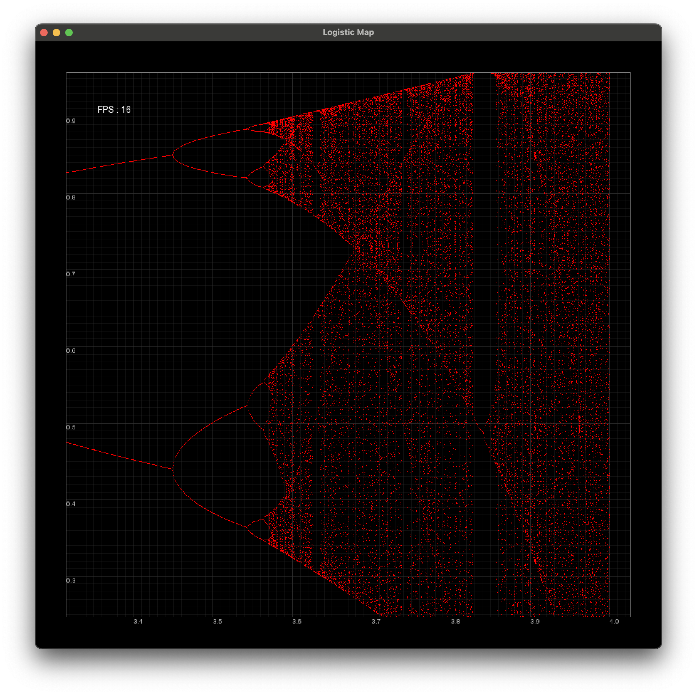

# Fractal Project (The Logistic Map)

#### A program that uses SFML to make a graphing tool, which is used visualize the logistic map.

## Overview

I stumbled across the logistic map and James Gleick's _Chaos_ online, and the first time I saw the math behind the logistic map, I knew I had to try and recreate it. I found the ties that the logistic map had to other fractals and chaotic systems really interesting. For this project I knew I'd need to make use of a graphics framework, and since I was trying to challenge myself to make use of C++ more, I decided to go with SFML (Simple Fast Multimedia Library), which is relatively easy to use compared to other options. Most of the challenge in this project ended up being in creating a space to display the points I wanted to, managing pixel spaces (integer coordinates that represent a pixel), world spaces (the actual ticks on the gridlines), rendering only what I need, and the gridlines.

## Tools

I knew that there were many tools that would simplify the project, but that wasn't really the goal. I used SFML, but made an attempt to use my own implementations of its features wherever I could.

From SFML I made use of:
- Windowing
- Rendering points in pixel space
- Rendering lines in pixel space given 2 points
- Rendering fonts
- Keyboard and trackpad input

I wanted to implement features like transforms and cameras myself.
I also made use of the Eigen library for linear algebra.

## The Future of the Project

The title implies a project that's more general than just the logistic map, and I do have plans to expand it, but I don't think I'll continue from this repository. I started running into performance issues, which I'd need to address by learning more involved techniques for displaying things. Feeding SFML 10,000 points and letting it figure it out isn't super fast. I'd need to do a lot more learning in a framework like SFML and start to mold the project to whatever framework I'm using. Longer term I'd like to be building more projects inside of Vulkan, so if I were to dedicate the time to learning a framework, that's what I'd prefer to be using. Once I get more comfortable within Vulkan this project might see a much faster sequel with some better fractal renders.

# Screenshots

