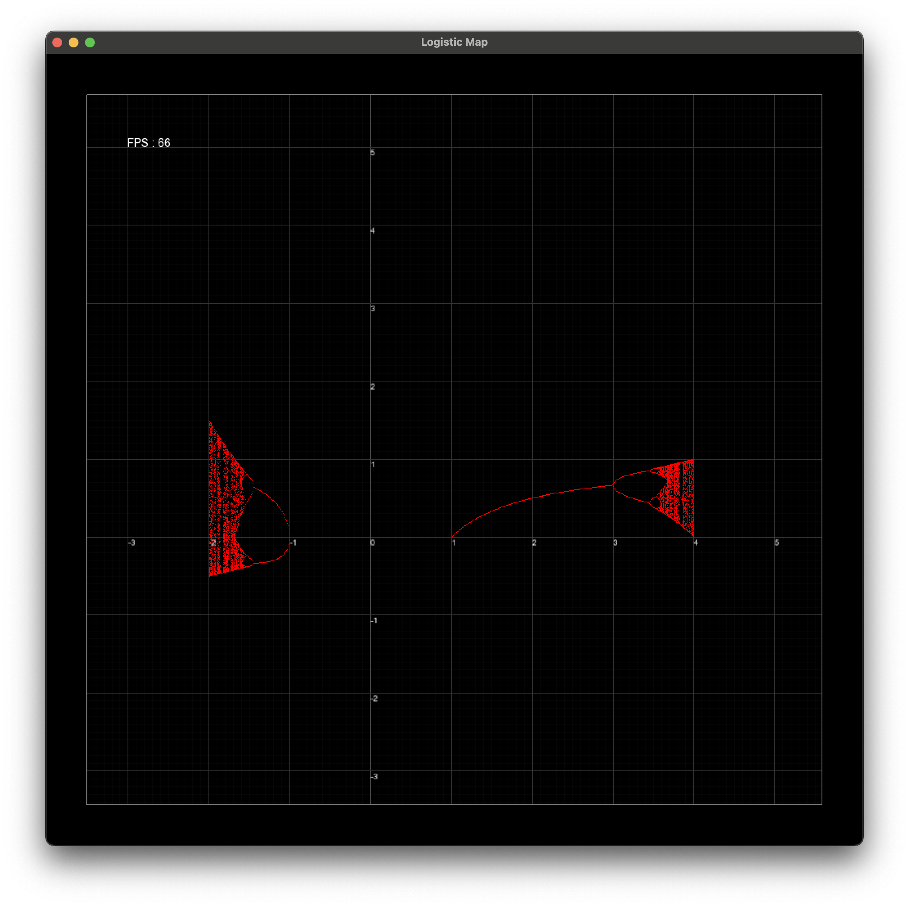

# The Logistic Map and Graphing Software

#### A program that uses SFML to make a graphing tool, which is used to visualize the logistic map.

## Overview

I stumbled across the logistic map and James Gleick's _Chaos_ online. The first time I saw the deceiving simplicity of the rules that dictate the logistic map, I knew I’d want to implement a visual representation of this concept. I would need to make use of a graphics framework, so I decided to go with Simple Fast Multimedia Library (SFML), which was a relatively easy option that allowed me to continue to grow my C++ skills. After finishing a basic visual, I continued to expand the graphing capabilities by allowing the user to pan and zoom, add fading gridlines, and add number ticks. 

## Tools Used

Within SFML I made an effort to reimplement as much as I could, but not everything was feasible to reimplement. Below is a list of the SFML features that I made use of.

Windowing
Rendering points in pixel space
Rendering lines in pixel space given two points
Rendering fonts
Keyboard and trackpad input


Similar to my ASCII project, I made use of the following.

The Eigen library for linear algebra
The C++ language
The GCC compiler for C++
CMake as a build tool
CLion as a development environment
Git/GitHub for version control

## Going from Graph Space to Pixel Space with Linear Algebra, the transformToMatrix3f function
My favorite aspect of this project was managing the different coordinate spaces. I wanted to borrow from my previous projects where transformations between coordinate spaces were represented as matrices. In this project, the setup is that the graph is described with upper and lower bounds on the X and Y axis in both pixel space and graph space. This ```transformToMatrix3f``` function takes the rectangular 2D input space and rectangular 2D output space, and returns a 3x3 matrix which transforms a homogeneous coordinate in the input space to a corresponding point in the output space.

In summary, the function returns a matrix that allows me to quickly find where a coordinate on the graph would land as a pixel in the window. This was a very fun puzzle to work through and challenged how well I was able to think about matrices and homogeneous coordinates.

## Current Problems and the Future of the Project

With the title of the repository implying such a broad scope, it’s not hard to imagine that I have other ideas. I’d like to implement more fractal-like patterns and allow the user to swap between visuals.

However, when I tried to execute on these ideas I ran into performance issues. These were difficult to address without taking advantage of more advanced SFML specific rendering techniques. I decided that longer-term I'd like to switch to learning and building more projects using Vulkan. Once I get more comfortable with Vulkan, I’m hoping this project will get a much more performant sequel.

# Screenshots



